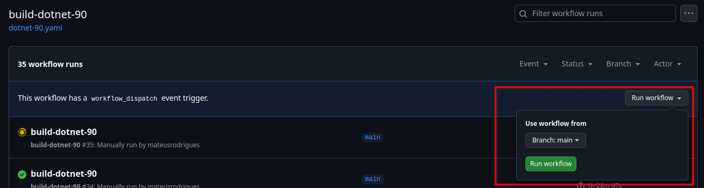
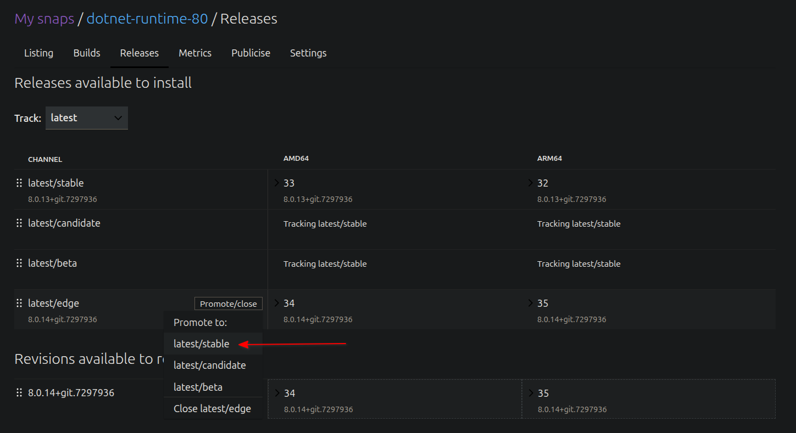
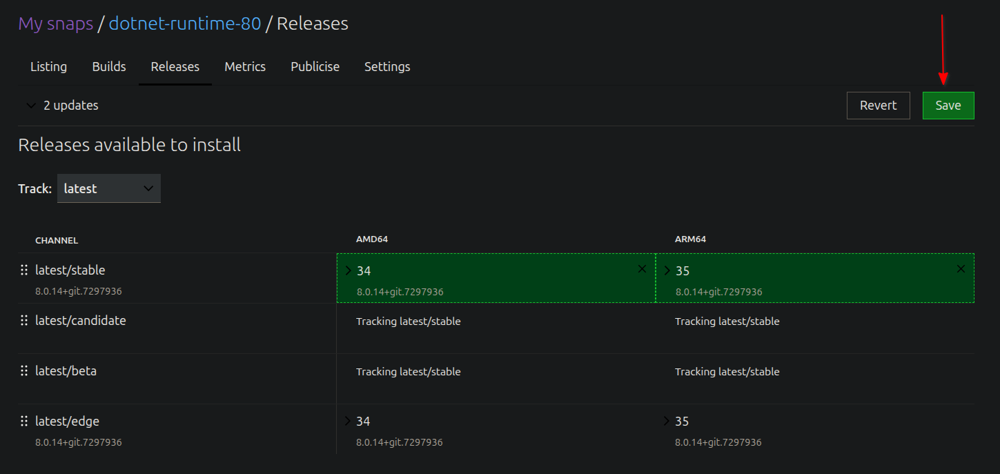

# Manually publish a .NET content snap update to the Snap Store

When a new .NET monthly update ships and there are no changes to the content in this repository, a manual deployment of these updates to the Snap Store needs to be made. This document outlines the necessary steps to make that deployment.

## 1. Copy new .NET packages to PPA

The content snaps are built using packages from the [`~dotnet/snaps`](https://launchpad.net/~dotnet/+archive/ubuntu/snaps) Launchpad PPA. For the new builds to have access to the new packages, copy them to the PPA using the following command:

```
copy-package --from $FROM --suite $FROM_SUITE --to ~dotnet/ubuntu/snaps --to-suite jammy --include-binaries $DOTNET_PKG
```

Where:
- `$FROM` is the archive to copy the package from, e.g. `ubuntu` or `~dotnet/ubuntu/backports`.
- `$FROM_SUITE` is the suite to copy the package from, e.g. `jammy-proposed` or `jammy`.
- `$DOTNET_PKG` is the .NET source package to copy, e.g. `dotnet9` or `dotnet8`.

> [!IMPORTANT]
> The content snaps are built on top of the `core22` base snap, so make sure to always use packages that target the Jammy release.

> [!NOTE]
> The `copy-package` command is provided by the [ubuntu-archive-tools](https://code.launchpad.net/~ubuntu-archive/ubuntu-archive-tools/+git/ubuntu-archive-tools) repository.

Please, wait the copied packages to be published by the Launchpad publisher before proceeding.

## 2. Trigger the GitHub Actions workflows

For each .NET major version being updated, find the corresponding GitHub Actions workflow to trigger.

A single GitHub workflow will build all three content snaps for its own .NET major version, e.g. `build-dotnet-60` will build the `dotnet-runtime-60`, `aspnetcore-runtime-60`, and `dotnet-sdk-60` snaps.

| .NET Version      | GH Actions Workflow                                                                                     |
| ----------------- | ------------------------------------------------------------------------------------------------------- |
| .NET 6            | [build-dotnet-60](https://github.com/canonical/dotnet-content-snaps/actions/workflows/dotnet-60.yaml)   |
| .NET 7            | [build-dotnet-70](https://github.com/canonical/dotnet-content-snaps/actions/workflows/dotnet-70.yaml)   |
| .NET 8            | [build-dotnet-80](https://github.com/canonical/dotnet-content-snaps/actions/workflows/dotnet-80.yaml)   |
| .NET 9            | [build-dotnet-90](https://github.com/canonical/dotnet-content-snaps/actions/workflows/dotnet-90.yaml)   |
| .NET 10           | [build-dotnet-100](https://github.com/canonical/dotnet-content-snaps/actions/workflows/dotnet-100.yaml) |

Then, trigger the workflow manually by clicking on "Run Workflow".



Now, wait for the workflows to finish running before going to step 3.

## 3. Promote snaps to `latest/stable`

The workflows will publish the content snaps to `latest/edge` by default. If further testing on the content snaps need to occur, run them against that track before continuing with the promotion.

If everything is in order, go to [snapcraft.io/snaps](https://snapcraft.io/snaps) and manually go into each published snap and promote them to `latest/stable`.

> [!IMPORTANT]
> It is a recommended best-practice that the snap in `latest/edge` is kept so that both tracks are open simultaneously, so do not close the `latest/edge` track after the promotion.




