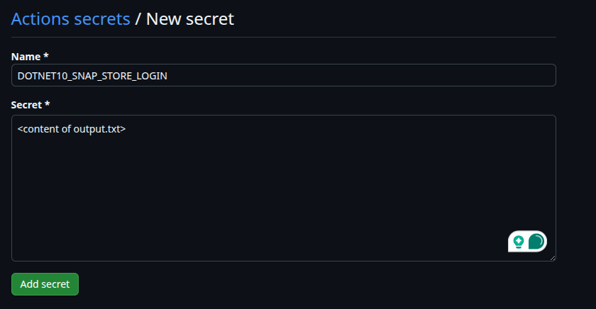

# Publishing a new .NET major version

When a new .NET major version is available, there is a series of steps that should be taken to make it available as Runtime and SDK content snaps.

## 1. Register the snap names

New snap names should be registered in the Snap Store following the same naming convention as current content snap names:

| .NET Version      | Content Snap names                                                     |
| ----------------- | ---------------------------------------------------------------------- |
| .NET 6            | `dotnet-runtime-60`<br/>`aspnetcore-runtime-60`<br/>`dotnet-sdk-60`    |
| .NET 7            | `dotnet-runtime-70`                                                    |
| .NET 8            | `dotnet-runtime-80`<br/>`aspnetcore-runtime-80`<br/>`dotnet-sdk-80`    |
| .NET 9            | `dotnet-runtime-90`<br/>`aspnetcore-runtime-90`<br/>`dotnet-sdk-90`    |
| .NET 10           | `dotnet-runtime-100`<br/>`aspnetcore-runtime-100`<br/>`dotnet-sdk-100` |

## 2. Export the Snap Store token for the new .NET major version

Once the snap names are registered, a new Snap Store token should be exported, which allows the GitHub Actions workflows to publish to the newly registered names.

Each .NET major version has its own store token, which permits uploads only to the set of content snaps pertaining to that major version.

To export a store token to the new .NET major version, run the following command:

```bash
snapcraft export-login --snaps=dotnet-runtime-100,dotnet-sdk-100,aspnetcore-runtime-100 --acls package_access,package_push,package_update,package_release output.txt
```

> [!NOTE]
> Replace the value passed to the argument `--snaps` with a comma-separated list of names of the newly registered content snaps.

Once the token is exported, copy the content of `output.txt` to a new repository secret called `DOTNETX_SNAP_STORE_LOGIN`, replace the `DOTNETX` part with the .NET major version being added, e.g., `DOTNET10_SNAP_STORE_LOGIN`.

To add a new repository secret, go to "Settings" > "Secrets and variables" > "Actions" > "[New repository secret](https://github.com/canonical/dotnet-content-snaps/settings/secrets/actions/new)".



## 3. Add the relevant snaps

Once the secret is in place, add the snap files under the `snaps/` directory.

## 4. Add a new GitHub Actions workflow

A new GitHub Actions workflow should be added for the new .NET major version. You can copy the workflow file of the previous release and work off of it, only changing the necessary values (including the snap store login token name).

| .NET Version      | GH Actions Workflow                                                                                     |
| ----------------- | ------------------------------------------------------------------------------------------------------- |
| .NET 6            | [build-dotnet-60](https://github.com/canonical/dotnet-content-snaps/actions/workflows/dotnet-60.yaml)   |
| .NET 7            | [build-dotnet-70](https://github.com/canonical/dotnet-content-snaps/actions/workflows/dotnet-70.yaml)   |
| .NET 8            | [build-dotnet-80](https://github.com/canonical/dotnet-content-snaps/actions/workflows/dotnet-80.yaml)   |
| .NET 9            | [build-dotnet-90](https://github.com/canonical/dotnet-content-snaps/actions/workflows/dotnet-90.yaml)   |
| .NET 10           | [build-dotnet-100](https://github.com/canonical/dotnet-content-snaps/actions/workflows/dotnet-100.yaml) |
